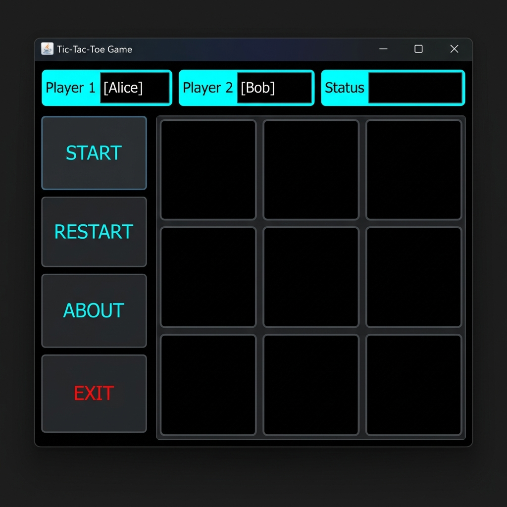
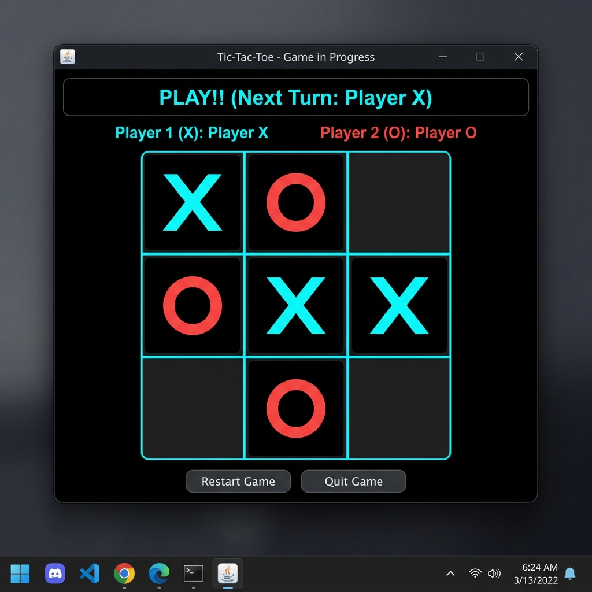
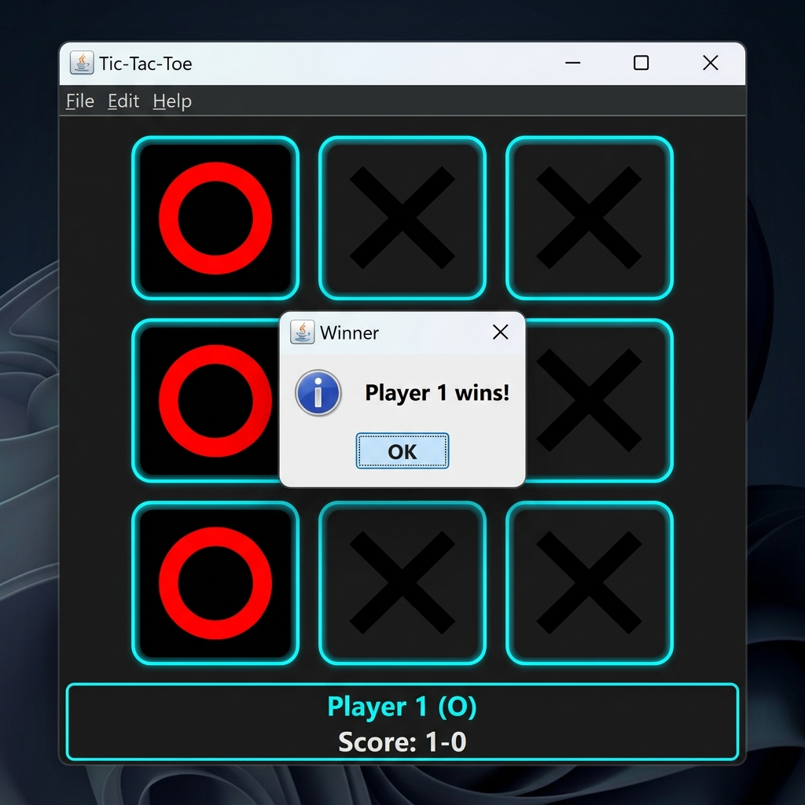

# Tic-Tac-Toe Java Edition

A classic Tic-Tac-Toe game built with Java Swing. This project features a modern dark-themed interface with Player vs Player functionality.

## Features
- **Modern Dark UI**: Sleek black and cyan color palette.
- **Custom Player Names**: Enter player names before starting the game.
- **Status Indicators**: Real-time status updates (e.g., "PLAY!!").
- **Win/Draw Detection**: Automatic detection of win combinations or draws with popup notifications.
- **Restart/About/Exit**: Easy navigation and game reset.

## Screenshots




## How to Run
1. Ensure you have Java Development Kit (JDK) installed.
2. Download `tictac3.java`.
3. Open terminal/command prompt and navigate to the folder.
4. Compile the code:
   ```bash
   javac tictac3.java
   ```
5. Run the game:
   ```bash
   java tictac3
   ```

## Created By
**Azhar Khan** - *Initial Work & Design*
